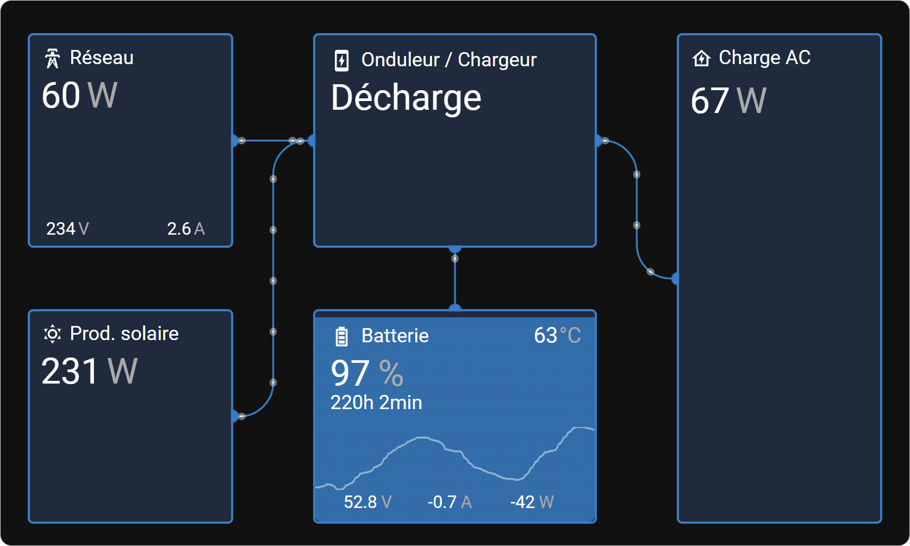

# 🗲 - Venus OS Dashboard - 🗲




## **What is Venus OS Dashboard ?**

Venus OS Dashboard is a card that replicates the look and feel of the Venus OS GUI v2 for [Home Assistant][home-assistant] Dashboard UI.

---

### Features

-   🛠  Full editor for all options (no need to edit `yaml`)
-   😍 Icon picker
-   ⚓ Entity picker
-   🚀 Zero dependencies : no need to install additional cards.
-   🌈 Based on Material UI
-   🌓 Supports both light and dark themes
-   🌎 Internationalization

---

## **Installation**

### HACS


### Manual Installation

1. Place this package inside the www directory (or any subdirectory within www) in Home Assistant.

2. Add the resource in Settings → Dashboards → Three dots (top right) → Resources.

3. Click on "Add resource" and enter the following URL :
  - If you placed the venus directory directly in www, use :

```bash
/local/venus/venus.js
```

  - If you placed it in www/community, use:
```bash
/local/community/venus/venus.js
```

4. Select "JavaScript Module" and click "Create".

5. Restart Home Assistant.

And voilà! Venus OS Dashboard should now be available in the Lovelace card picker menu.

Enjoy! 🎉

---

## Usage

Venus OS Dashboard can be configured using Dashboard UI editor.

1. In Dashboard UI, click 3 dots in top right corner.
2. Click _Edit Dashboard_.
3. Click Plus button to add a new card.
4. Find the _Custom: Venus OS Dashboard card in the list.

