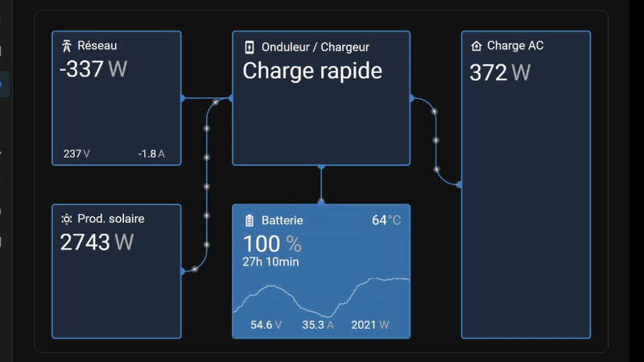
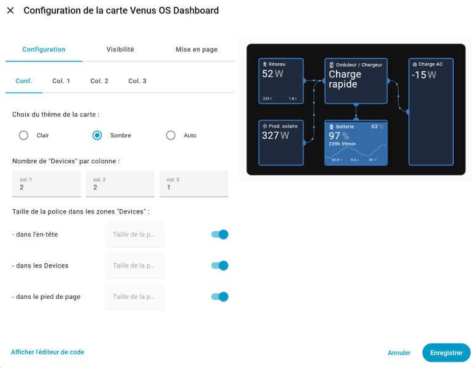

# 🗲 - Venus OS Dashboard - 🗲





## **What is Venus OS Dashboard ?**

Venus OS Dashboard is a card that replicates the look and feel of the Venus OS GUI v2 for [Home Assistant][home-assistant] Dashboard UI.

---

### Features

-   🛠  Full editor for all options (no need to edit `yaml`)
-   😍 Icon picker
-   ⚓ Entity picker
-   🚀 Zero dependencies : no need to install additional cards.
-   🌈 Based on Material UI
-   🌓 Supports both light and dark themes
-   🌎 Internationalization :
      FR | EN | IT | ES | PT | DE | NL

---

### Behavioral / Feature Differences

new feature with some inspired from KeonHHH fork (thanks for him):

| Feature / Area | All Version | New Version |
|----------------|:-------------:|-------------------:|
| Power flow animation | Single moving ball | Multi-ball Venus OS dot train |
| Localization | English / French | German, Italian, Portuges... |
| Documentation / README | Minimal, no YAML config | Full configuration reference, MQTT guide, troubleshooting |
| Example layout | Not included | Added `example.yaml` (Grid, Solar, Inverter, Loads, Battery) |
| Editor / UX | Some untranslated UI | Improved editor UI, translated strings |
| VRM visual match | resemblance | animations, sizing — closer to VRM style |

## **Installation**

### HACS

[](https://my.home-assistant.io/redirect/hacs_repository/?owner=skydarc&repository=Venus-OS-Dashboard&category=plugin)

1. Make sure [HACS](https://hacs.xyz/) is installed in your Home Assistant instance
2. Add this repository as a custom repository in HACS:
   - Go to HACS
   - Click the three dots in the top right corner
   - Select "Custom repositories"
   - Add the URL of this repository
   - Select "dashboard" as the category
3. Click "Install" in HACS
4. Restart Home Assistant

And voilà! Venus OS Dashboard should now be available in the Lovelace card picker menu.

Enjoy! 🎉

### Manual Installation

1. Place this package inside the www directory (or any subdirectory within www) in Home Assistant.

2. Add the resource in Settings → Dashboards → Three dots (top right) → Resources.

3. Click on "Add resource" and enter the following URL :
  - If you placed the venus directory directly in www, use :

```bash
/local/venus/venus.js
```

  - If you placed it in www/community, use:
```bash
/local/community/venus/venus.js
```

4. Select "JavaScript Module" and click "Create".

5. Restart Home Assistant.

And voilà! Venus OS Dashboard should now be available in the Lovelace card picker menu.

Enjoy! 🎉

---

## Usage

Venus OS Dashboard can be configured using Dashboard UI editor.

1. In Dashboard UI, click 3 dots in top right corner.
2. Click _Edit Dashboard_.
3. Click Plus button to add a new card.
4. Find the _Custom: Venus OS Dashboard card in the list.

### New Animation Threshold

The animationThreshold parameter controls (for each link) when the animated balls on connection lines appear or disappear:

- When power flow is above the threshold (in absolute value), balls are visible and animate
- When power flow is below the threshold, balls fade out and disappear
- No Default value: If not set, no threshold. 
- Unit same as value entity.
- Works with both positive and negative values (grid import/export, battery charge/discharge)

### devices (required)

A map of device boxes keyed by "<column>-<box>" (for example 1-1, 2-1, 3-2). Each device entry supports:

- name — display title (string).

- icon — mdi or other icon string.

- entity — main entity shown large in the box (e.g., sensor.grid_total).

- headerEntity — optional small value shown in header (e.g., battery temperature).

- entity2 — optional second sensor shown near main sensor (smaller).

- footerEntity1 / footerEntity2 / footerEntity3 — optional values shown in the footer row (three cols).

- graph: true — show mini-history graph in that box (requires historical data).

- gauge: true — show vertical gauge fill (expects percentage % to work correctly).

- anchors — define anchor points on the box used to connect links. Format: comma-separated items T-2, B-1, L-1, R-1 where T/B/L/R = top/bottom/left/right and number = position index. Example: "L-1, B-2, R-1".

- link — map of link definitions (named, e.g. "1", "2"). Each link object:

   - start — anchor id on this box (e.g. R-1).

   - end — anchor id on the target box (e.g. 2-1_L-1 — this uses target box coordinate format).

   - entity — optional entity controlling direction/speed of animated balls along the link.

   - inv: "true" — optional flag to invert direction for that link (inv means the link's direction multiplier will be toggled).

### How anchors and links work

- When rendering boxes, the card creates anchor DOM elements at positions on box edges (left, right, top, bottom).

- creatAnchors() positions anchors evenly depending on the number specified (e.g., B-2 creates two anchors along the bottom).

- creatLine() draws an SVG path between anchor coordinates and creates animated "balls" following the path.

- If you see NaN warnings in console the anchor ID might not exist or layout not yet ready — check your anchors strings and box ids.

### Creating sensors (Victron Cerbo / Multiplus / Venus OS on RPI / MQTT)

- If you use Victron + Cerbo + MQTT you’ll often get power topics like:
  ```yaml
  cerbo/N/<id>/system/0/Ac/Consumption/L1/Power
  cerbo/N/<id>/system/0/Ac/ConsumptionOnInput/L1/Power
   ```
   use [mqtt-explorer ](https://mqtt-explorer.com/) to explore all values and 
   
- Example MQTT sensor entries to add to sensor.yaml:
  ```yaml
   - platform: mqtt
     unique_id: cerbo_ac_consumption_l1_power
     name: "AC Consumption L1 Power"
     state_topic: "cerbo/N/<id>/system/0/Ac/Consumption/L1/Power"
     device_class: power
     state_class: measurement
     unit_of_measurement: "W"
     value_template: "{{ value | float | round(0) }}"

   - platform: mqtt
     unique_id: cerbo_ac_consumption_on_input_l1_power
     name: "AC Consumption On Input L1 Power"
     state_topic: "cerbo/N/<id>/system/0/Ac/ConsumptionOnInput/L1/Power"
     device_class: power
     state_class: measurement
     unit_of_measurement: "W"
     value_template: "{{ value | float | round(0) }}"
   ```
- If the MQTT messages are JSON with { "value": 123 } use value_json.value in the value_template.

### Rounding & numeric formatting

- The dashboard code previously rounded the main entity value but left headerEntity, entity2 and the footer values unrounded. If you want all displayed numbers rounded (or to show 1/2 decimals), add a small helper in fillBox():
  ```yaml
  function formatValue(raw) {
  if (raw === undefined || raw === null) return '';
  if (raw === 'N/C' || raw === 'unavailable' || raw === 'unknown') return raw;
  const n = parseFloat(raw);
  return isNaN(n) ? raw : Math.round(n); // change rounding here if you want decimals
   }
  ```
  Then call formatValue(...) for all state.state uses.

### Troubleshooting

- Empty graphs / no historic data — make sure recorder includes the entities and that HA's history is recording them.
   
- Anchor/NaN errors — verify anchors syntax and boxCol sizes; check in browser console the DOM to confirm anchors exist with expected IDs.
   
- Only one dot on path — path is likely very short. Check anchor positions; increase spacingPx or reduce it to force more dots. Also ensure path.getTotalLength() returns a value — certain SVG path commands/format may cause problems.
   
- External control / Inverter state not showing — subscribe to cerbo/N/<your-id>/# with an MQTT client (MQTT Explorer) to find which topic maps to the inverter state. Often settings/Settings/CGwacs/Hub4Mode or system/0/Ac/Inverter/State or vebus/<deviceid>/State contain the useful state.
   
- Widgets not responsive — ensure checkReSize() is called or use razDashboardOldWidth() after resizing; the card uses the bounding rect to recalc layout.

