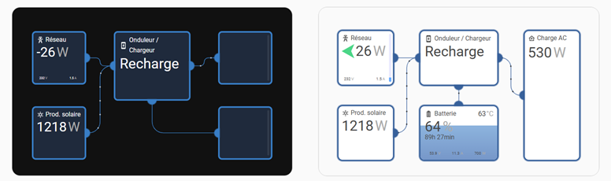
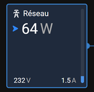
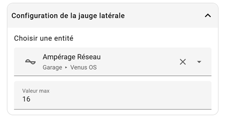
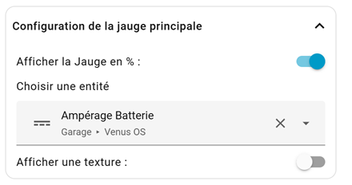
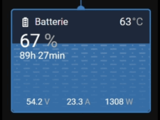
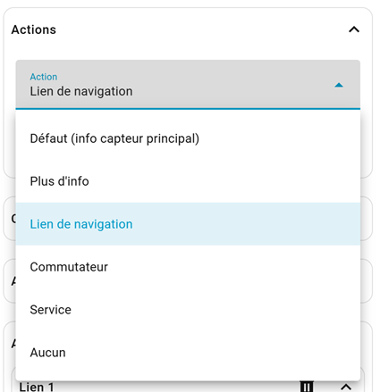

# 🗲 Venus OS Dashboard 🗲

 

------------------------------------------------------------------------

## 🚀 What is Venus OS Dashboard?

**Venus OS Dashboard** is a custom Lovelace card that replicates the
look and feel of the **Venus OS GUI v2** inside the [Home
Assistant](https://www.home-assistant.io/) Dashboard UI.

It visually matches the VRM / Venus OS interface while remaining fully
customizable within Home Assistant.

------------------------------------------------------------------------

## ✨ Features

-   🛠 Full UI editor (no need to edit `yaml`)
-   😍 Built-in icon picker
-   ⚓ Built-in entity picker
-   🚀 Zero dependencies — no additional custom cards required
-   🌈 Based on Material UI
-   🌓 Supports both light and dark themes
-   🌍 Internationalization support:\
    FR \| EN \| IT \| ES \| PT \| DE \| NL \| RU \| PL \| TR \| AR

> ⚠ Some language files may not be perfect --- feel free to submit
> corrections.

------------------------------------------------------------------------

## 🔄 Behavioral / Feature Differences

Some features are inspired by KeonHHH's fork — thanks to him 🙏

| Feature / Area | Previous Versions | New Version |
|---------------|-------------------|-------------|
| Power flow animation | Single moving dot | Multi-dot Venus OS style animation |
| Localization | English / French | German, Italian, Portuguese, and more |
| Documentation / README | Minimal, no YAML config | Full configuration reference, MQTT guide, troubleshooting |
| Example layout | Not included | Added `example.yaml` (Grid, Solar, Inverter, Loads, Battery) |
| Editor / UX | Some untranslated UI | Improved editor UI with translated strings |
| VRM visual match | Approximate | Closer animations and sizing, matching the VRM style more closely |
| Multiple instances in one panel | Buggy, no linking| Multiple cards supported in one ha panel |


------------------------------------------------------------------------

## 🆕 New Features

-   Replace +/- signs with directional arrows (optional toggle)
-   New side gauge (Venus OS style), optional and multicolor
-   Added languages: RU, PL, TR, AR
-   Optional background texture for the main gauge
-   Optional wave animation for the main gauge
-   Redesigned tap action management

------------------------------------------------------------------------

# 📦 Installation

## 🔹 HACS (Recommended)

[](https://my.home-assistant.io/redirect/hacs_repository/?owner=skydarc&repository=Venus-OS-Dashboard&category=plugin)

**1.** Make sure [HACS](https://hacs.xyz/) is installed in your Home Assistant instance
**2.** Add this repository as a custom repository in HACS:
   - Go to HACS
   - Click the three dots in the top right corner
   - Select **Custom repositories**
   - Add the URL of this repository
   - Select **Dashboard** as the category
**3.** Click **Install** in HACS
**4.** Restart Home Assistant

And voilà! Venus OS Dashboard should now be available in the Lovelace card picker menu.

Enjoy! 🎉

------------------------------------------------------------------------

## 🔹 Manual Installation

**1.**  Copy the `venus` folder into your `www` directory.
**2.**  Go to Settings → Dashboards → Resources.
**3.**  Add:

If placed directly in `www`:

    /local/venus/venus.js

If placed in `www/community`:

    /local/community/venus/venus.js

**4.**  Select **JavaScript Module**.
**5.**  Restart Home Assistant.

------------------------------------------------------------------------

## Usage

Venus OS Dashboard can be configured using the Dashboard UI editor.

1. In the Dashboard UI, click the three dots in top right corner.
2. Click **Edit Dashboard**.
3. Click Plus button to add a new card.
4. Find **Custom: Venus OS Dashboard** card in the list.

------------------------------------------------------------------------

### New Animation Threshold

The animationThreshold parameter controls (for each link) when the animated balls on connection lines appear or disappear:

- When power flow is **above the threshold** (in absolute value), balls are visible and animate
- When power flow is **below the threshold**, balls fade out and disappear
- No Default value: If not set, no threshold is applied. 
- Uses the same unit as the linked entity.
- Works with both positive and negative values (grid import/export, battery charge/discharge)

------------------------------------------------------------------------

### New box max height

You can now define a **maximum height per box**, allowing bottom anchors like in the original version.



------------------------------------------------------------------------

### +/- icon replacement

Like in Venus-OS, you can replace +/- signs with Venus-OS style arrows.

The arrow :

 - Shows direction

 - Changes color depending on power flow

 - Fully optional (toggle in editor)

------------------------------------------------------------------------

### New side gauge

Again, as Venus-OS, you can add a small vertical gauge on the right side of any box.



Configuration example:



Just define:

 - An entity

 - A maximum value

and voilà!

------------------------------------------------------------------------

### Main Gauge Enhancements

New dedicated configuration ha-expansion-panel:



This menu is **disabled** if the main entity unit is not **"%"**.

Options include:

 - Background texture (for tank level style display)

 

 - Wave animation (Venus OS filling effect)

 

------------------------------------------------------------------------

### New action menu

A new ha-expansion-panel allows configuring box actions:



In UI Editor, only the "tap" action is available, but technically, **YAML also supports "hold" and "double tap"**.

**UI Editor supports:**

 - Tap action

**YAML additionally supports:**

 - Hold action

 - Double tap action

**Available actions:**

 - **Default** (show main entity info),
 - **More-info** (show selected entity),
 - **Navigation**, loads a HA panel using the "Navigation Path". This one don't have helper in the picker. But it's pretty easy to have le "navigation path". It's the second part of the url, after the "ip:port" couple.
   ex.: http://192.168.x.x:8123/energy -> "**/energy**" is the path
 - **Toggl**e (toggle selected entity),
 - **Call-service**, allows you to trigger any service, script, or automation,
 - **None**... disable the action on box,

Some YAML examples:

```yaml
      tap_action:
        action: more-info
        entity: sensor.venus_os_grid_current
```
```yaml
      hold_action:
        action: navigate
        navigation_path: /energy
```
```yaml
      tap_action:
        action: toggle
        entity: switch.venus_os_allow_max_charge_voltage
```
```yaml
      tap_action:
        action: call-service
        service: script.turn_on
        entity_id: script.victron_force_bulk
```
```yaml
      double_tap_action:
        action: call-service
        service: number.set_value
        entity_id: number.venus_os_ac_current_limit
        value: 3
```

------------------------------------------------------------------------

### devices (required)

A map of device boxes keyed by "<column>-<box>" (for example 1-1, 2-1, 3-2). Each device entry supports:

- name — display title (string).

- icon — mdi or other icon string.

- entity — main entity shown large in the box (e.g., sensor.grid_total).

- headerEntity — optional small value shown in header (e.g., battery temperature).

- entity2 — optional second sensor shown near main sensor (smaller).

- footerEntity1 / footerEntity2 / footerEntity3 — optional values shown in the footer row (three cols).

- graph: true — show mini-history graph in that box (requires historical data).

- gauge: true — show vertical gauge fill (expects percentage % to work correctly).

- anchors — define anchor points on the box used to connect links. Format: comma-separated items T-2, B-1, L-1, R-1 where T/B/L/R = top/bottom/left/right and number = position index. Example: "L-1, B-2, R-1".

- link — map of link definitions (named, e.g. "1", "2"). Each link object:

   - start — anchor id on this box (e.g. R-1).

   - end — anchor id on the target box (e.g. 2-1_L-1 — this uses target box coordinate format).

   - entity — optional entity controlling direction/speed of animated balls along the link.

   - inv: "true" — optional flag to invert direction for that link (inv means the link's direction multiplier will be toggled).

------------------------------------------------------------------------

### How anchors and links work

- When rendering boxes, the card creates anchor DOM elements at positions on box edges (left, right, top, bottom).

- creatAnchors() positions anchors evenly depending on the number specified (e.g., B-2 creates two anchors along the bottom).

- creatLine() draws an SVG path between anchor coordinates and creates animated "balls" following the path.

- If you see NaN warnings in the console, the anchor ID might not exist or the layout may not be ready yet — check your anchor strings and box IDs.

------------------------------------------------------------------------

### Creating sensors (Victron Cerbo / Multiplus / Venus OS on RPI / MQTT)

- If you use Victron + Cerbo + MQTT you’ll often get power topics like:
  ```yaml
  cerbo/N/<id>/system/0/Ac/Consumption/L1/Power
  cerbo/N/<id>/system/0/Ac/ConsumptionOnInput/L1/Power
   ```
   use [MQTT Explorer](https://mqtt-explorer.com/) to explore all available topics and values.
   
- Example MQTT sensor entries to add to sensor.yaml:
  ```yaml
   - platform: mqtt
     unique_id: cerbo_ac_consumption_l1_power
     name: "AC Consumption L1 Power"
     state_topic: "cerbo/N/<id>/system/0/Ac/Consumption/L1/Power"
     device_class: power
     state_class: measurement
     unit_of_measurement: "W"
     value_template: "{{ value | float | round(0) }}"

   - platform: mqtt
     unique_id: cerbo_ac_consumption_on_input_l1_power
     name: "AC Consumption On Input L1 Power"
     state_topic: "cerbo/N/<id>/system/0/Ac/ConsumptionOnInput/L1/Power"
     device_class: power
     state_class: measurement
     unit_of_measurement: "W"
     value_template: "{{ value | float | round(0) }}"
   ```
- If the MQTT messages are JSON (e.g., { "value": 123 }), use value_json.value in the value_template.

------------------------------------------------------------------------

### Rounding & numeric formatting

- The dashboard code previously rounded the main entity value but left headerEntity, entity2 and the footer values unrounded. If you want all displayed numbers rounded (or to show 1/2 decimals), add a small helper in fillBox():

  ```js
  function formatValue(raw) {
  if (raw === undefined || raw === null) return '';
  if (raw === 'N/C' || raw === 'unavailable' || raw === 'unknown') return raw;
  const n = parseFloat(raw);
  return isNaN(n) ? raw : Math.round(n); // change rounding here if you want decimals
   }
  ```
  
  Then call formatValue(...) for all state.state uses.

------------------------------------------------------------------------

### Troubleshooting

- Empty graphs / no historic data — make sure the Recorder integration includes the entities and that HA's history is recording them.
   
- Anchor/NaN errors — verify anchors syntax and boxCol sizes; check in browser console the DOM to confirm anchors exist with expected IDs.
   
- Only one dot on path — path is likely very short. Check anchor positions; increase spacingPx or reduce it to force more dots. Also ensure path.getTotalLength() returns a value — certain SVG path commands/format may cause problems.
   
- External control / Inverter state not showing — subscribe to cerbo/N/<your-id>/# with an MQTT client (MQTT Explorer) to find which topic maps to the inverter state. Often settings/Settings/CGwacs/Hub4Mode or system/0/Ac/Inverter/State or vebus/<deviceid>/State contain the useful state.
   
- Widgets not responsive — ensure checkReSize() is called or use razDashboardOldWidth() after resizing; the card uses the bounding rect to recalc layout.
